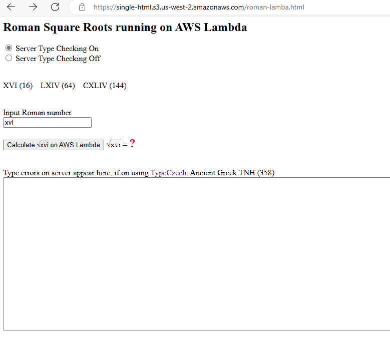

# Node.js AWS Lambda Example

 Finds square roots of Roman Numbers, with server type checking turned on or off in browser.
 - [Live Site](https://single-html.s3.us-west-2.amazonaws.com/roman-lamba.html)
  - [AWS Lambda](https://fdzz5y2xtnjspequaqfajio5zi0ifvyh.lambda-url.us-west-2.on.aws/?roman_param=xvi&type_check=yes) returning IV from XVI

## Install
	npm install
	npm run test
	setx AWS_PROFILE IAM-user-name
	cdk bootstrap
	cdk synth
	cdk deploy

 

